)

# Luxury Housing in King County

**Author:**
Pharoah Evelyn

## Overview

I use regression modeling to analyze house sales in King County, WA in order to build an appropriate luxury home for Bill Nye the Science Guy.

## Business Problem


Mr. Nye needs to know how the prices of homes can scale within King County.

We are building a new luxury home, however we do not have a specific budget in mind and need to create a home that would be competitive within the market for this county.

## Data Preparation

We are using the King County House Sales Set:
* The data file is in this GitHub Repository as `kc_house_data.csv`.
* An accompanying file, `column_names.md`, explains the naming conventions for each column title throughout our dataset.

Naturally, this data was not perfectly workable from the onset. 
So I had to run various data cleaning & preparation tactics in order to prepare for modeling. 

A visual of the steps taken can be found in my jupyter notebook.

## Methods Used

First, we took a look at the linearity of our data, using relevant columns.

I chose a series of regression plots to help show the relationships between two variables.

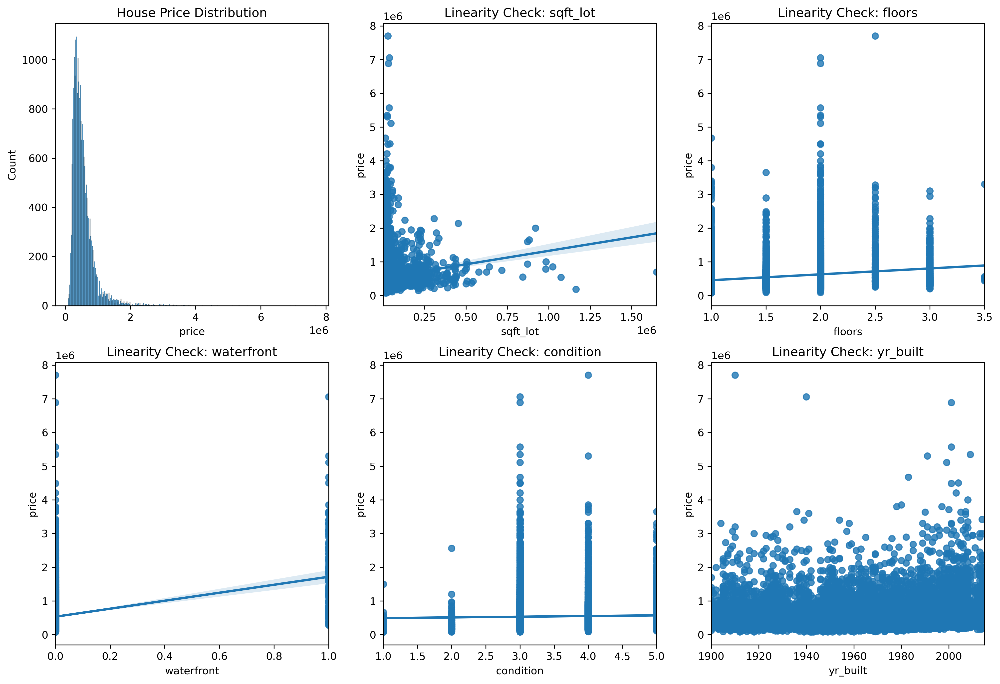

These charts tell us:
* `price` has outliers on the higher end
* `grade`, `sqft_living`, & `floors` have positive correlation with our target
* `zipcode` & `condition` appear neutral
---
Next, looked at the multicollinear relationships in the data, with a heatmap for visibility!
* Any value above 0.75 is considered extreme
* Variables do not need to be removed in this case
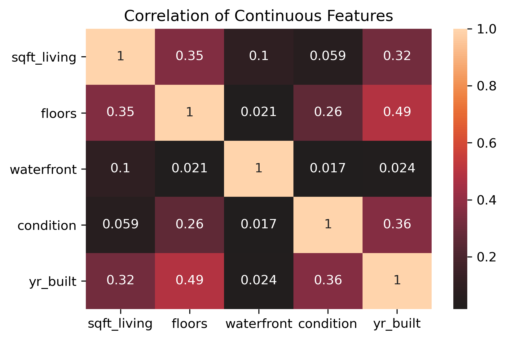

## Models

#### Initial Procedures
I created Training & Test splits from our original dataframe. Our models will use these to run predictions:
* Training is a 70% sample of our data
* Testing is a 30% sample of our Data

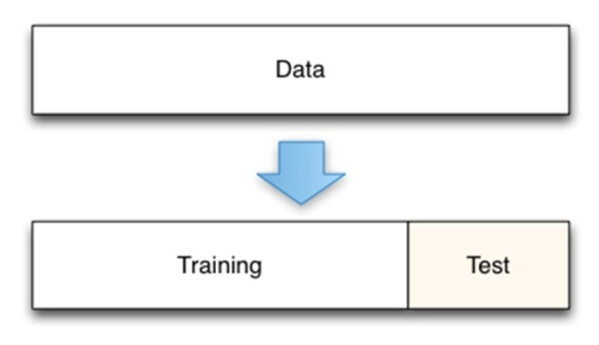

I also created a function that will return in-depth model data to us, using statsmodels. We can work with this to quickly run models going forward.

### Model 1
Findings on the original dataframe:
* Our base model explains 65% of the data
* We have 0 high p-values, meaning none of the data is random
* The average maximum error for our data predictions is less than $2.2 Million for both Training & Testing data

#### Model #1 Assumption Check
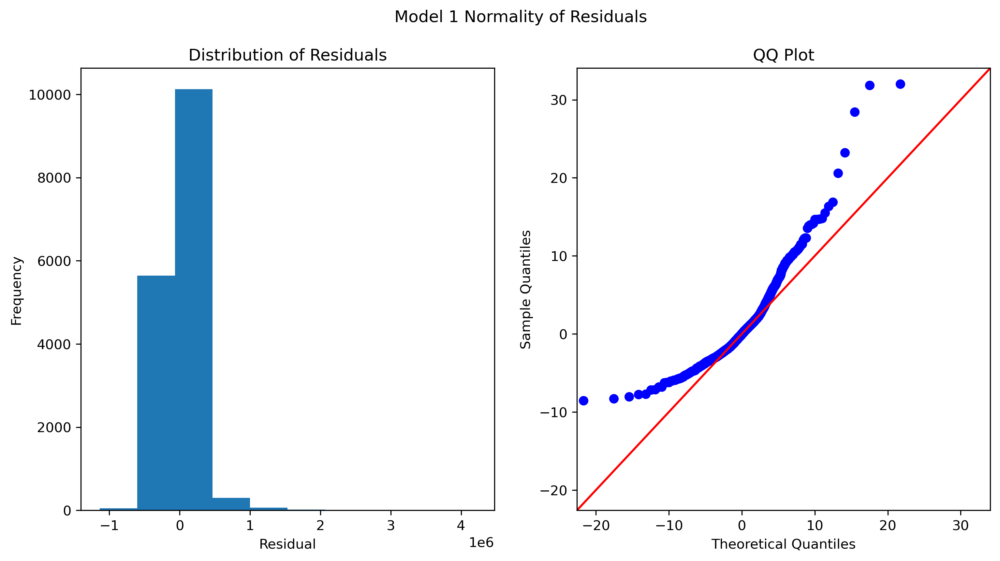
* Our histogram shows the data is mostly centered around 0
* Our QQ-plot shows a light-tailed normal relationship, but it also violates the normality assumption

#### Model #1 Homoscedasticity
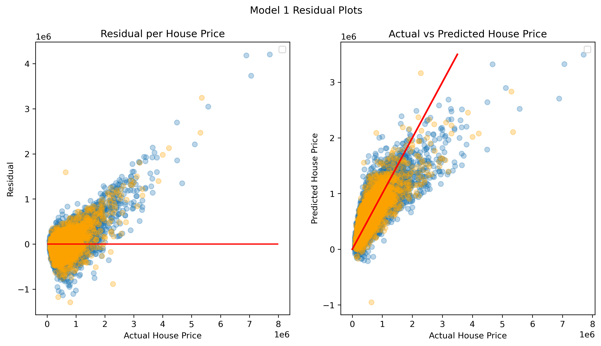

#### This data is not homoscedastic
`Residual per House Price` plot:
* The majority of the outliers are predicted too low, based on our data
* Data that is predicted too high does not have that many outliers
* Our model does not have consistent performance above the $2 Million in the price range
Data does not appear to be consistent. 
But, we could use this model to predict housing that is under $2.2 Million.

### Scaled Model
Since there were errors in our first model, we needed to try & scale our data to improve the performance of our model, along with gaining insights.
* I used Scikit-Learn’s Standardscaler, to refit the data. So everything is more in line with each other
* After running this model, a coefficient analysis says:
  * Features that most positively impact price: `grade` & `sqft_living`
  * Features that most negatively impact price: `bedrooms` & `yr_built`

#### Scaled Model Assumption Check
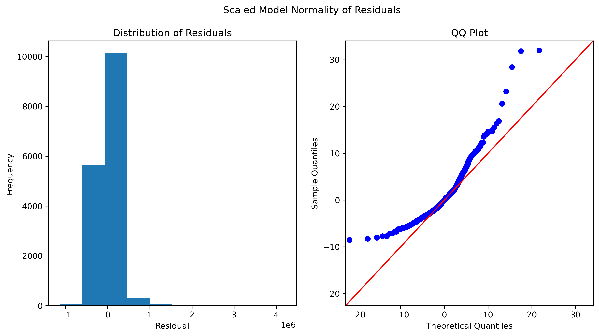

In short, our charts here appear to have no changes when compared to Model 1.

#### Scaled Model Homoscedasticity
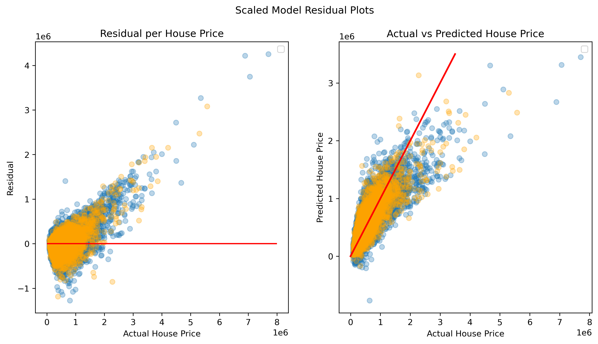

This data is not homoscedastic.
Overall, there are no changes between this model, and Model #1.

### Model 2
Based on previous findings, we needed to filter out outliers in order to improve the performance of our model’s homoscedasticity.

In order to accomplish this, I created pivot tables from the Training & Testing data.
* Data above the 95% percentile was cut on both dataframes, as since it was in this area did majority of outliers lie

With brand new datasets to run models with, we now have a new source of models to run and explore.
* sqft_lot data began to show some randomness in its p-value
Thus, we had to remove this column from our subset data going forward, in order to attain more reliable results.

#### Findings on the subset data:
* Our base model explains 57% of the data
* We have 0 high p-values, meaning none of the data is random
* The average maximum error for our data predictions is less than $1.4 Million for both Training & Testing data
* We’ve removed about 5.21% of the training data from the original model

#### Model #2 Assumption Check
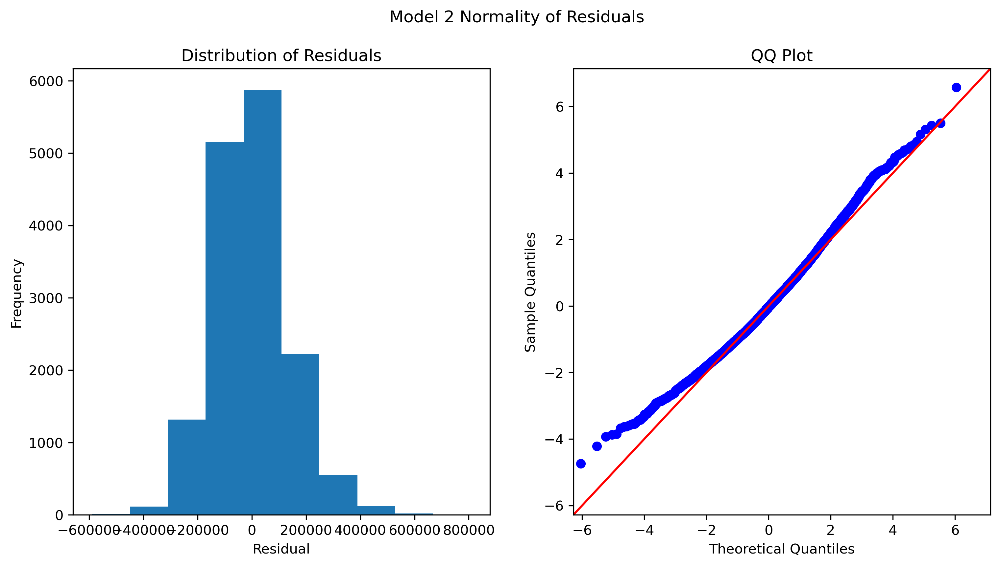
* Our data now fits the normality assumption much better
* Data is much more normally distributed on the histogram

#### Model #2 Homoscedasticity
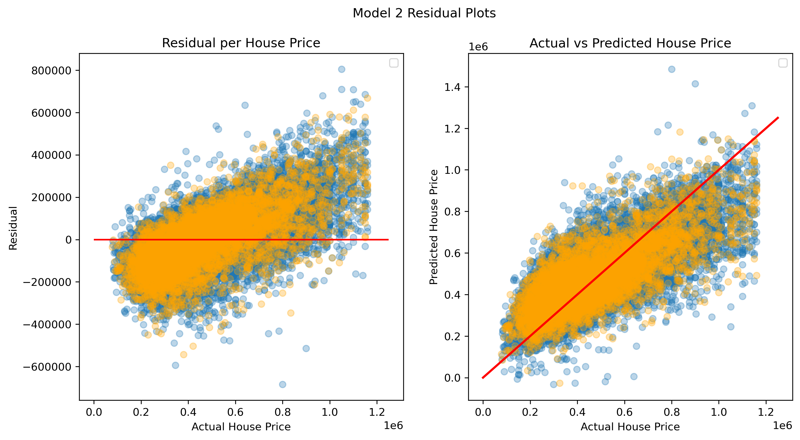
This data is homoscedastic
* Data is heavily skewed in terms of uniformity on our prediction line
* Our updated second model appears to predict our data in the lower price ranges too low, and the data in the higher ranges too high

### Model 3
Steps were repeated for Model #2: 
* Removed outliers above the 95th percentile
* There was no randomness indicated by high p-values from our 3rd model

Findings on the subset data:
* Our base model explains 51% of the data
* We have 0 high p-values, meaning none of the data is random
* The average maximum error for our data predictions is less than $1.3 Million for both Training & Testing data
* We’ve removed about 5.4% of the training data

#### Model #3 Assumption Check
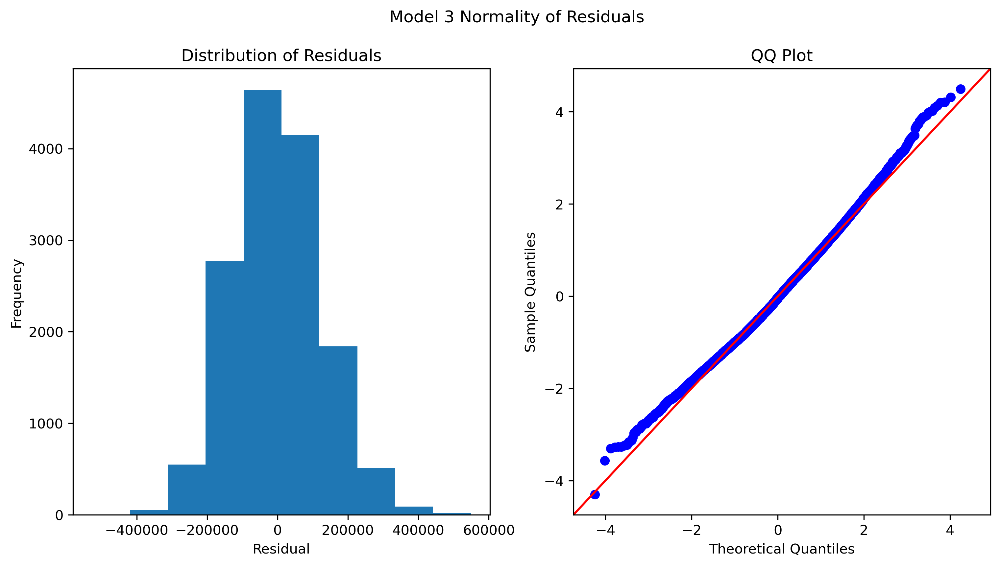
Our data now has further improvements on the QQ-plot & Histogram! 

#### Model #3 Homoscedasticity
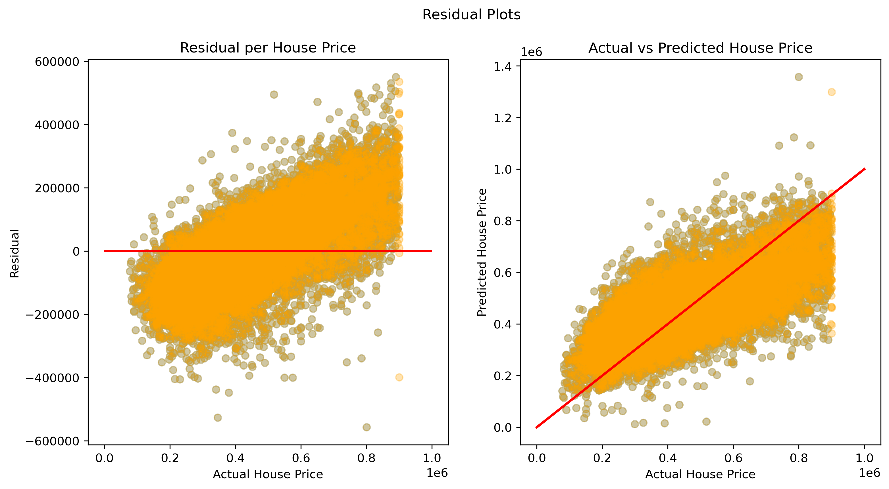
This data is homoscedastic
* Our data appears more uniform when compared to our Model 2 results
* The Testing data is spot on when matching the training data, for our predictions
* Data is still not perfectly in line with our prediction line

## Conclusions

According to our scaled model:
* The grade of a house given by Kings County, and its size in Square Feet have the most positive impact on house price
* At the same time: The number of bedrooms & the year a house was built has the most negative impact on house price

#### In terms of all other models:
* Predicting house prices can be pretty challenging because it depends on a multitude of factors
* The King County dataset has a lot of outliers that were skewing our models' outputs
* **Our final model is best to be used for homes that are under $900K in price** since it violates our assumptions to the least degree
* Our final model uniformly predicts the test data with the training data, save for a few outliers here and there. Is reliable around 50% of the time
From here, we can use our final model to finally come up with actual blueprints for the perfect home

## Recommendations

* Build a house that maximizes square footage & keeps the bedroom count low
* Have large bedrooms rather than a high number of bedrooms
* Inspect the grading standards of King County, to ensure that this house will receive a good grade. Which will in turn increase its value
* Build a house that is under $1 Million in price, since our model is unreliable above that price range

## Next Steps

* Look into cost-effective ways to build a home in order to maximize profits
* Contact King County for guidelines on highly graded homes

## For More Information

Please review the full analysis in the [Jupyter Notebook](./King_County_Housing_Investigation.ipynb) or this [presentation](./DS_Project_Presentation_2.pdf).

For any additional questions, please contact Pharoah Evelyn at pharoahevelyn@gmail.com
## Repository Structure
A description of the structure of this repository and its contents:

```
└── images                              <- Both sourced externally and generated from code
├── data                         <- Sourced externally from code
├── Luxury_Housing_in_King_County.ipynb   
    ^^ Narrative documentation of analysis in Jupyter notebook
├── DS_Project_Presentation_2.pdf       <- PDF version of project presentation
├── README.md                           <- The top-level README for reviewers of this project

```
